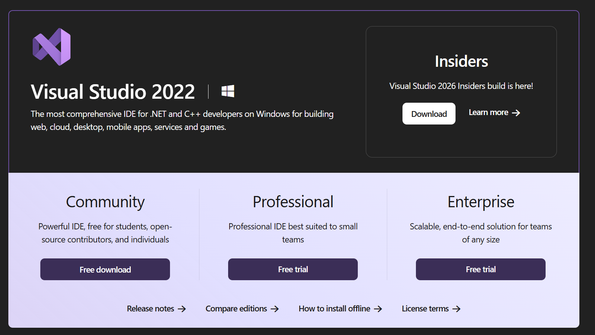
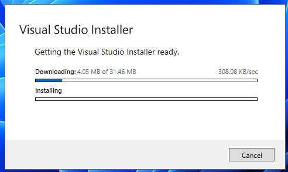
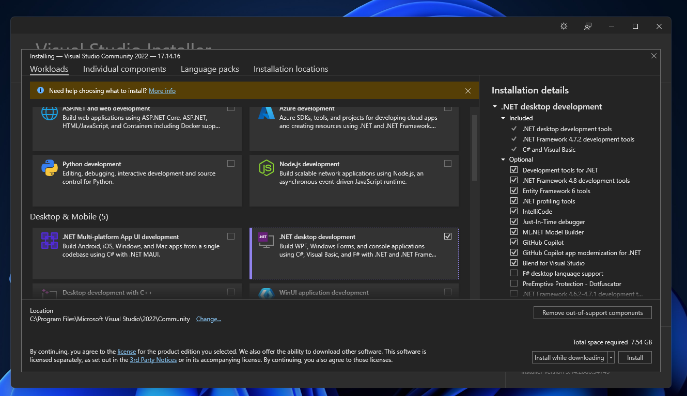
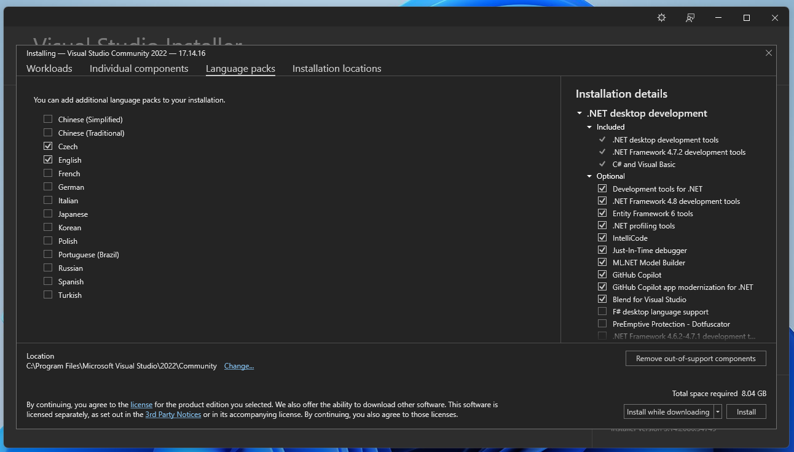
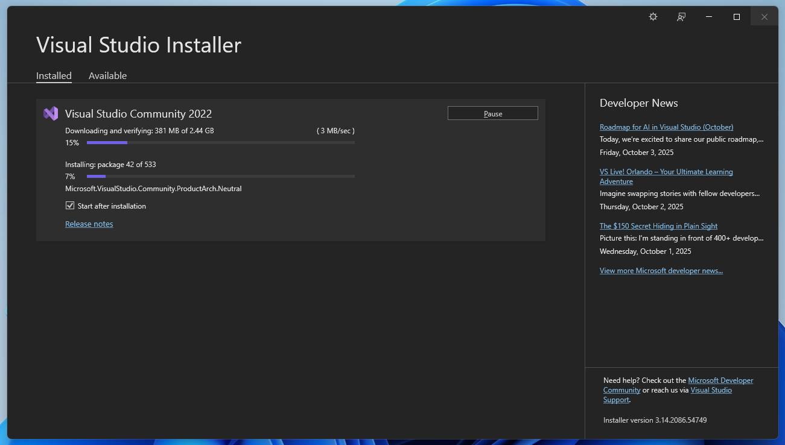
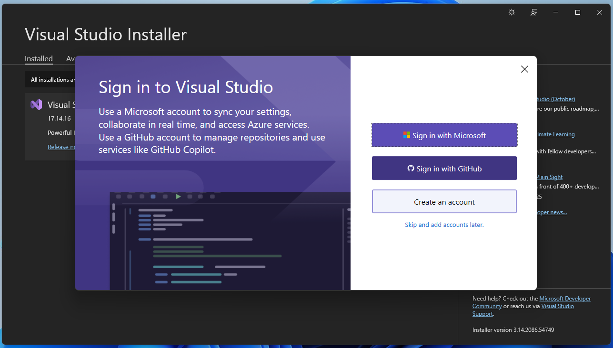
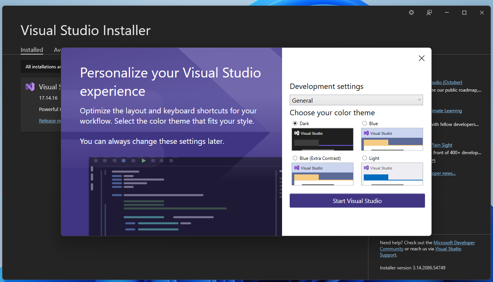
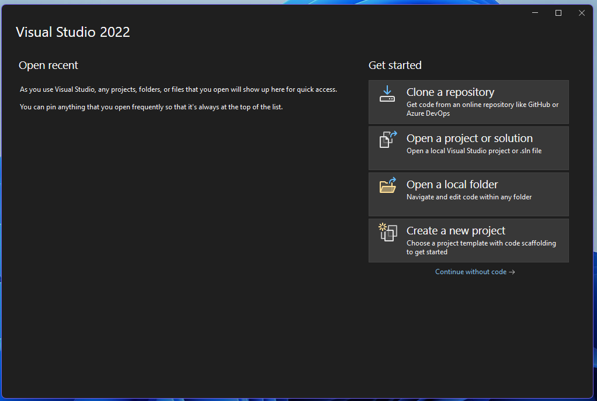
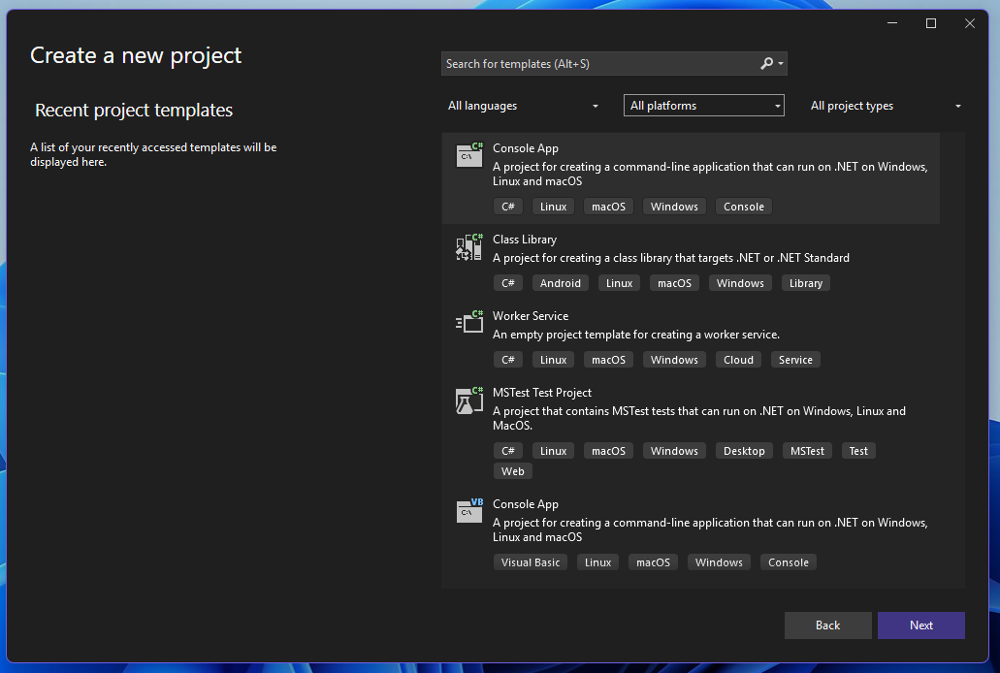
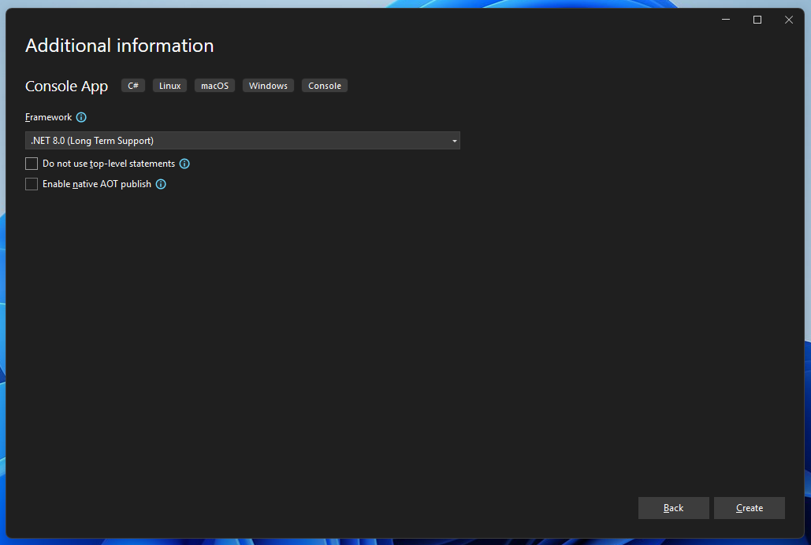

# 🧰 Instalace Visual Studio Community 2022

Visual Studio Community 2022 je bezplatné vývojové prostředí od společnosti **Microsoft**, určené pro jednotlivce, studenty a malé týmy. Nabízí kompletní sadu nástrojů pro vývoj aplikací v jazycích jako **C#, C++, Python, .NET, JavaScript** a mnoho dalších. My ho využijeme pro tvorbu jednoduchých konzolových aplikací v jazyce C#.

---

## 🔽 1. Stažení instalátoru

1. Otevřete oficiální stránku: [https://visualstudio.microsoft.com/downloads/](https://visualstudio.microsoft.com/downloads/)
2. Klikněte na tlačítko **"Free download"** u edice *Visual Studio Community 2022*.



### ⚠️ Pozor
**Je důležité si nesplést VisualStudio 2022 a Visual Studio Code. Pro instalaci VSC je potřeba jiný postup, na který se tento manuál nesoustředí a tato metodika.**

---

## ⚙️ 2. Spuštění instalátoru

Po stažení souboru `VisualStudioSetup.exe` jej spusťte.
Instalátor nejprve stáhne potřebné součásti.



---

## 🧩 3. Výběr Workloads

1. Zobrazí se nabídka modulů - pro toto školení je třeba nainstalovat *.NET desktop development*.



2. V záložce *Language packs* vyberte požadované jazyky vývojového prostředí. Tato metodika využívá anglické (English) prostředí pro výuku.



---

## 💾 4. Instalace

1. Klikněte na **"Install"**, případně *"Modify"*.
    - Instalace může trvat několik minut podle zvolených komponent a rychlosti internetu.



2. Pokud nechcete, aby se Visual Studio spustilo ihned po instalaci, nechte zatržítko **"Start after installation"** nazaškrtnuté

---

## 🚀 5. První spuštění

1. Po dokončení instalace spusťte Visual Studio. (případně se spustí automaticky)
2. Můžete přihlásit pomocí účtu Microsoft a zvolit barevné téma.
    - Přihlášení není pro toto školení nutné, lze pokračovat bez přihlášení -> klikněte na **"Skip and add accounts later."**





---

## ✅ 6. Vytvoření nového projektu

1. Klikněte na **"Create a new project"**



2. Vyberte šablonu **Console App (C#)**.



3. Projekt pojmenujete
4. Vyberte verzi frameworku (ideálně nejnovější LTS, tato metodika pracuje s **.NET 8.0 LTS**)
5. Vyberte, zda chcete použít "top-level statements"
    - Top-level statements jsou ideální pro jednoduché programy, kde se nevyužívají metody, nebo třídy
    - V prvních 2 lekcích se pracuje s touto možností



### Top-level statements kód
```csharp
Console.WriteLine("Hello World!");
```

### Low-level statements kód
```csharp
namespace FirstProject
{
    internal class Program
    {
        static void Main(string[] args)
        {
            Console.WriteLine("Hello, World!");
        }
    }
}
```